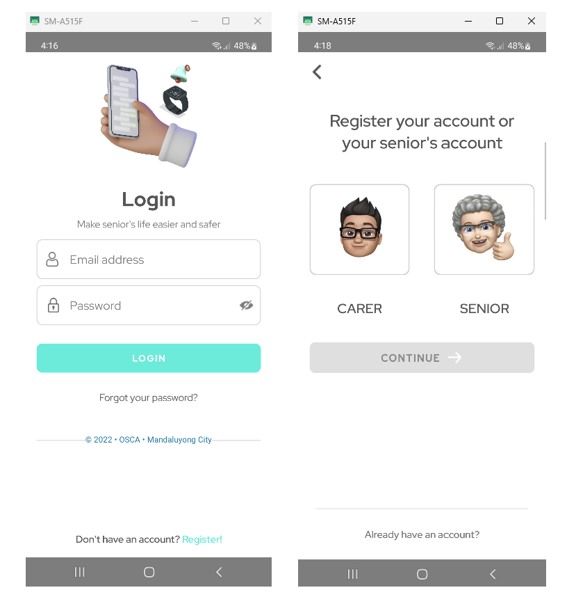
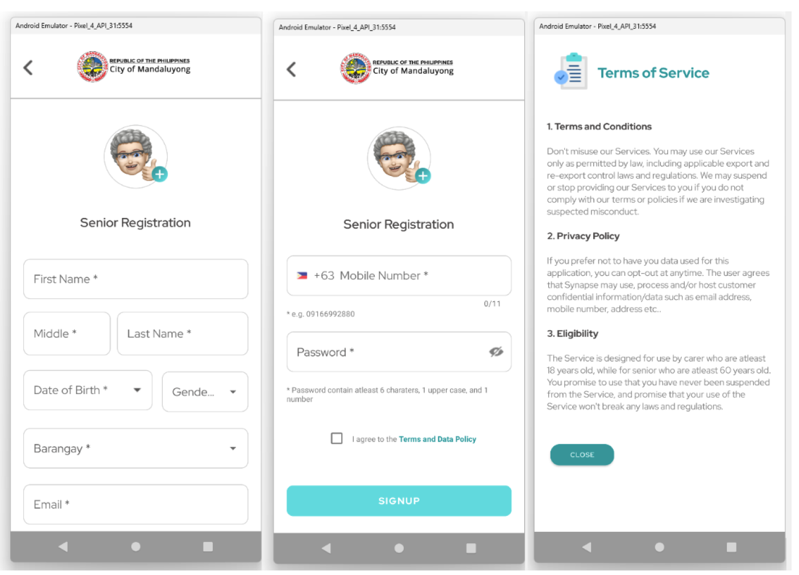
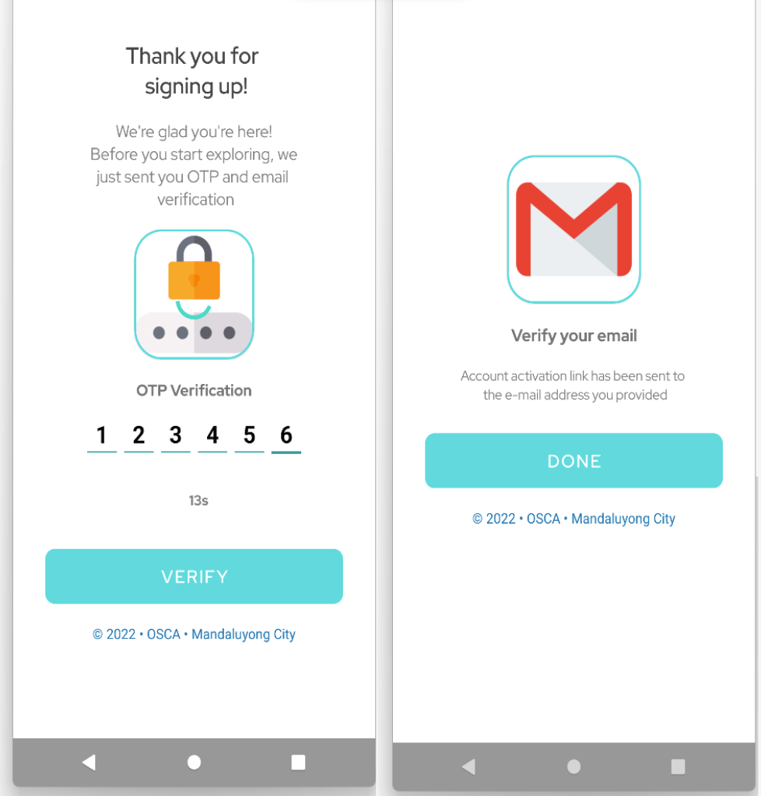
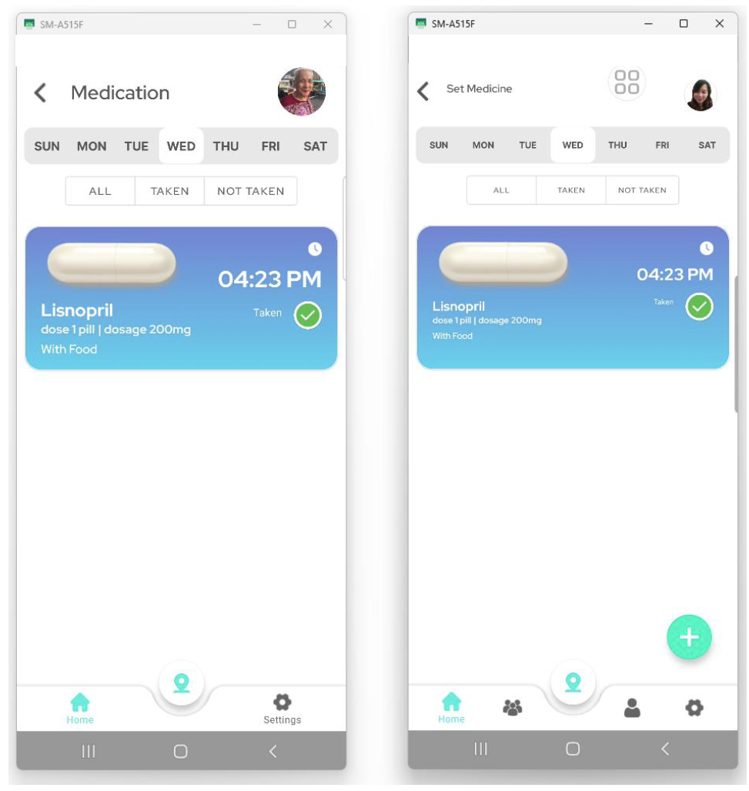
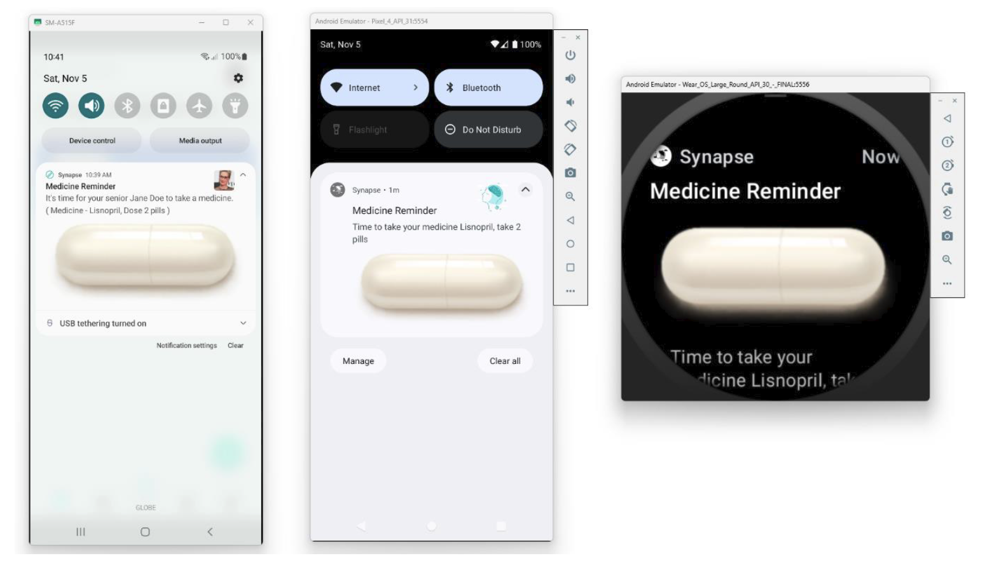
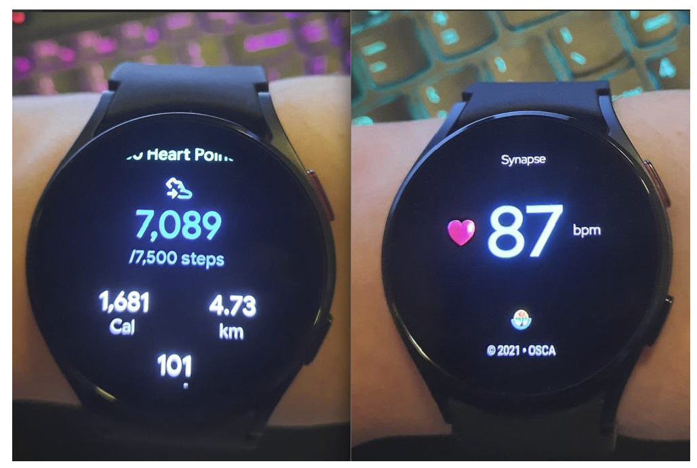
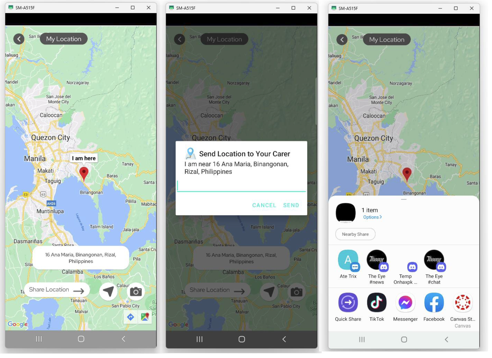
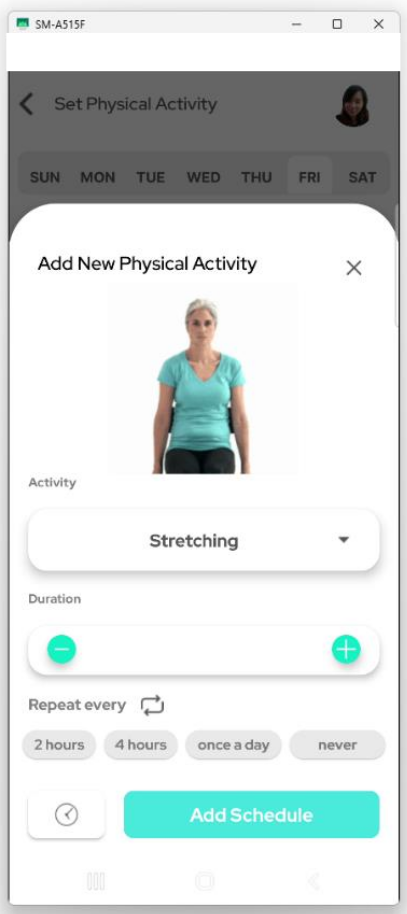
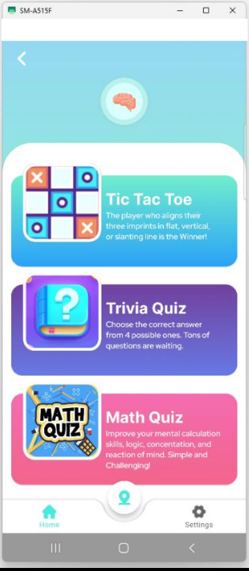

# Synapse
<p align="center"><a href="https://ibb.co/ckpqjCY"></a></p>

These are the project files for capstone project carried out at José Rizal University. The code
has been made available as a reference if anyone would like to reproduce the results of the capstone.
Please cite the capstone project if this repository is useful for your research.

```Please cite this  project if this repository is useful for your research.```

## Capstone Overview
Synapse is a mobile application with integration of Android wear smartwatch. The aim of this project
was to create memory support for senior citizens with Mild Cognitive Impairment or [MCI](https://www.alz.org/alzheimers-dementia/what-is-dementia/related_conditions/mild-cognitive-impairment).

Target organization: Office for Senior Citizens Affair Mandaluyong (OSCA)

Read Full Paper: ["Synapse: A Memory Support Mobile Application with Wearable Technology Integration for
Senior Citizens with Mild Cognitive Impairment"](fullpaper/Semaphore_FinalChapter1-5.pdf)

## Features
:wrench: v9
* Carers can set notification reminders that remind senior citizens of actions needed at particular
times, specifically medication, appointment, physical activity, and game reminders
* Cognitive games for Senior citizens: tic-tac-toe, math quiz, trivia quiz
* GPS tracking both for carers and seniors
* Admin access: dashboard of OSCA for data visualization and audit trail
* In sync heart rate and step counts for both mobile and smart watch

## Built with
* Java
* Kotlin
* Firebase
* Lots of Patience :beer:
* Vim :muscle:

## Getting started
To get the local copy of this repository, please run the following commands on your terminal:

```$ git clone https://github.com/PizaaRiaaa/Synapse.git```

* project files for wearable: [click here](synapsewear)

* project files for admin: [click here](osca_admin)

## Usage
if you want to use Synapse, you will need the following libraries:
* [Firebase database](https://firebase.google.com/products/realtime-database?gclsrc=ds&gclsrc=ds&gclid=COyivcbyq_wCFRUFvAodkAQPtw) for realtime database
* [Firebase storage](https://firebase.google.com/products/storage?gclsrc=ds&gclsrc=ds&gclid=CJ3a1IXzq_wCFYK5vAod-kUE_A) to store user's images
* [Firebase messaging](https://firebase.google.com/docs/cloud-messaging) or FCM for sending push notification
* [Picasso](https://square.github.io/picasso/) for image loading
* [CookieBar 2](https://github.com/AviranAbady/CookieBar2) for displaying interactive message on the screen
* [Volley](https://google.github.io/volley/) for HTTP library
* [Google Map API](https://developers.google.com/maps/documentation/android-sdk/get-api-key) to locate carer and senior location
* [Health Connect API](https://developer.android.com/guide/health-and-fitness/health-connect) for realtime heart rate and step counts
* [Gif drawable](https://github.com/koral--/android-gif-drawable) for gif extension support
* [MPAndroidChart](https://github.com/PhilJay/MPAndroidChart) chart library for admin's data visualization

## Development Environment

* _windows 11 22H2 64bit_
* _android studio dolphin 2021.3.1 Patch 1_
* _java 18.0.2.1_

## Preview










## License
This project is [GPL](LICENSE) Licensed.
